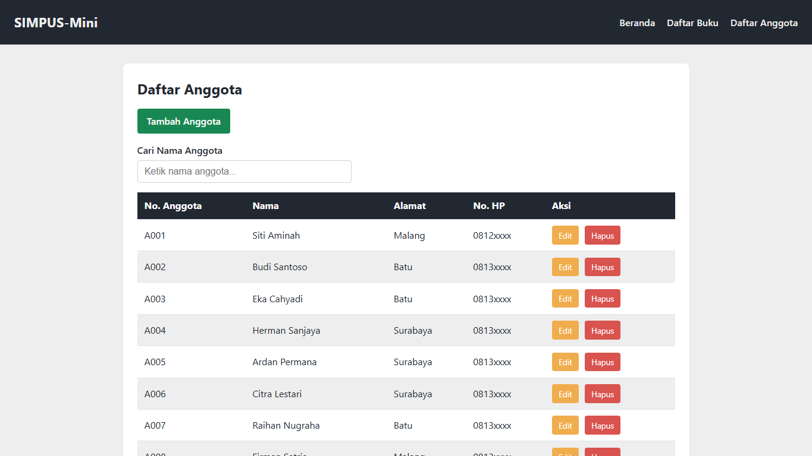

# Laporan Praktikum Jobsheet 6

## Fetch API & JSON

### Identitas

| Keterangan | Isi |
|---|---|
| Nama | Haikal Maghsin |
| NIM | 254107020189 |
| Kelas | TI 2D |
| Mata Kuliah | Desain dan Pemrograman Web |

## 1. Tujuan

Tujuan Jobsheet 6 adalah memisahkan data dari HTML dan memuatnya secara dinamis menggunakan Fetch API. Materi yang diterapkan meliputi pembuatan file JSON, pengambilan data dengan `fetch()`, render tabel menggunakan JavaScript, loading indicator, dan error handling.

## 2. Langkah Pengerjaan

Saya membuat folder `Jobsheet6` dari hasil Jobsheet 5. Tampilan, warna, halaman edit, dan validasi form tetap dipertahankan. Perubahan utama ada pada halaman daftar buku dan daftar anggota.

### 2.1 Membuat Data JSON

Data buku dipindahkan ke:

```text
Jobsheet6/data/buku.json
```

Data anggota dipindahkan ke:

```text
Jobsheet6/data/anggota.json
```

Jumlah data tetap mengikuti proyek saya, yaitu sepuluh buku dan sepuluh anggota.

### 2.2 Mengosongkan Body Tabel

Pada halaman daftar buku dan daftar anggota, bagian `<tbody>` tidak lagi berisi data statis. Baris tabel akan dibuat oleh JavaScript setelah data JSON berhasil dimuat.

### 2.3 Mengambil Data dengan Fetch

Halaman daftar buku memakai `assets/js/buku.js`, sedangkan halaman daftar anggota memakai `assets/js/anggota.js`.

Contoh alurnya:

```text
fetch data JSON -> ubah ke array JavaScript -> buat baris tabel -> tampilkan ke tbody
```




### 2.4 Loading dan Error Handling

Saya menambahkan teks "Memuat data..." sebelum proses fetch selesai. Jika file JSON gagal dibaca, halaman menampilkan pesan error di dalam tabel.

Tombol Hapus juga disesuaikan memakai event delegation karena tombolnya baru dibuat setelah data JSON selesai dirender.

## 3. Improvisasi

Saya menyesuaikan data JSON dengan data yang sudah dipakai sejak jobsheet awal. Versi ini memakai sepuluh buku dan sepuluh anggota agar konsisten dengan Jobsheet 1 sampai 5.

Saya juga tetap mempertahankan halaman edit, validasi form, pencarian tabel, dan tema warna SIMPUS-Mini.

## 4. Hasil Pengujian

| No. | Pengujian | Hasil |
|---:|---|---|
| 1 | File `buku.json` valid | Berhasil |
| 2 | File `anggota.json` valid | Berhasil |
| 3 | Daftar buku tampil dari JSON | Berhasil |
| 4 | Daftar anggota tampil dari JSON | Berhasil |
| 5 | Loading indicator muncul saat data dimuat | Berhasil |
| 6 | Pencarian tetap bekerja setelah data dirender | Berhasil |
| 7 | Tombol Hapus bekerja pada baris hasil fetch | Berhasil |
| 8 | Halaman tetap responsif | Berhasil |

## 5. Kendala

Kendala pada Jobsheet 6 adalah data belum tersimpan permanen setelah baris dihapus dari tampilan. Hal ini terjadi karena kode masih mengambil data dari file JSON statis, yaitu `data/buku.json` dan `data/anggota.json`, belum dari database atau API yang bisa menyimpan perubahan.

Selain itu, tombol Edit masih membuka halaman edit biasa dan belum membawa data sesuai baris yang dipilih. Penyebabnya karena `buku.js` dan `anggota.js` baru membuat baris tabel dari JSON, belum mengirim id data melalui query string atau penyimpanan sementara.

## 6. Kesimpulan

Pada Jobsheet 6 saya berhasil memisahkan data dari HTML ke file JSON dan menampilkannya kembali menggunakan Fetch API. Halaman daftar buku dan daftar anggota sekarang lebih dinamis karena isi tabel dibuat oleh JavaScript.

Materi ini menjadi jembatan sebelum data benar-benar diambil dari server dan database pada jobsheet berikutnya.
