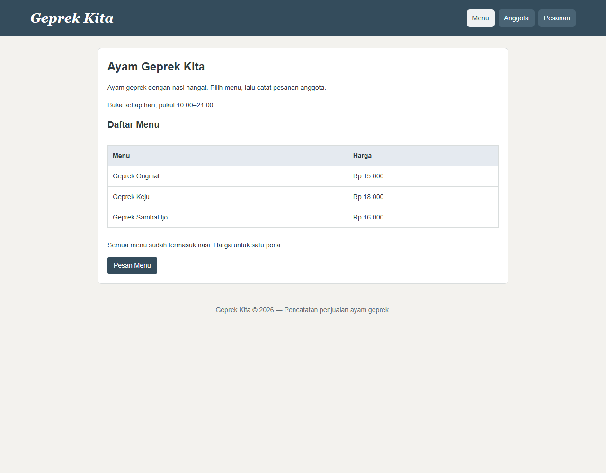
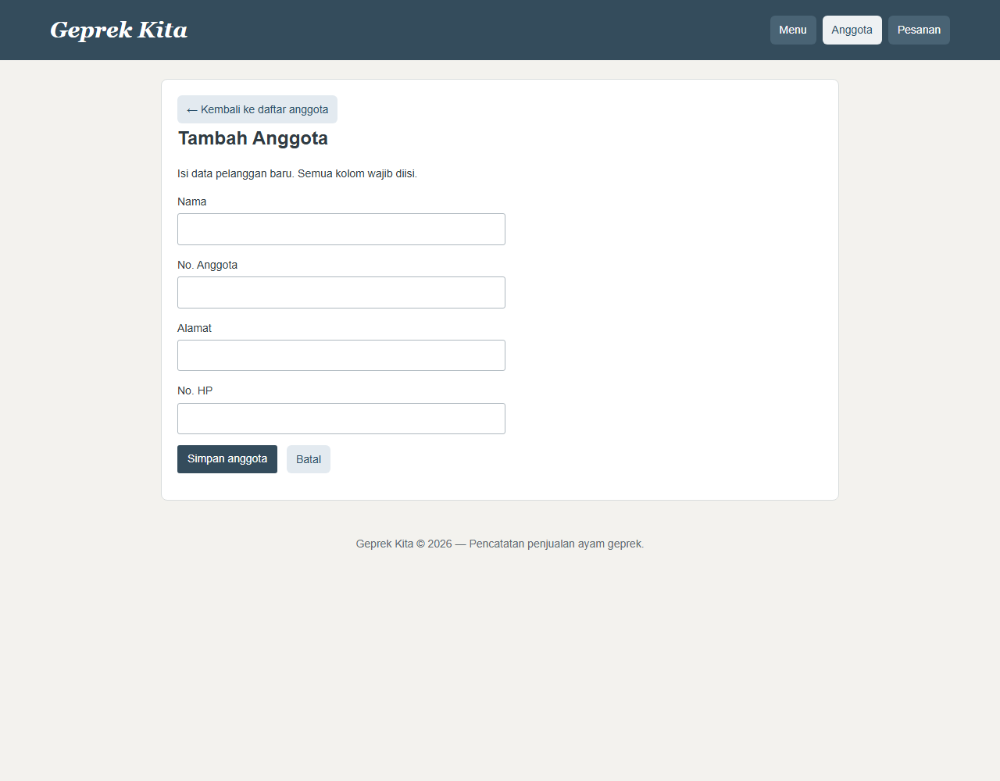
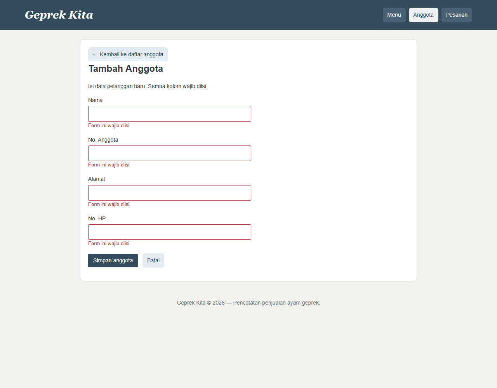
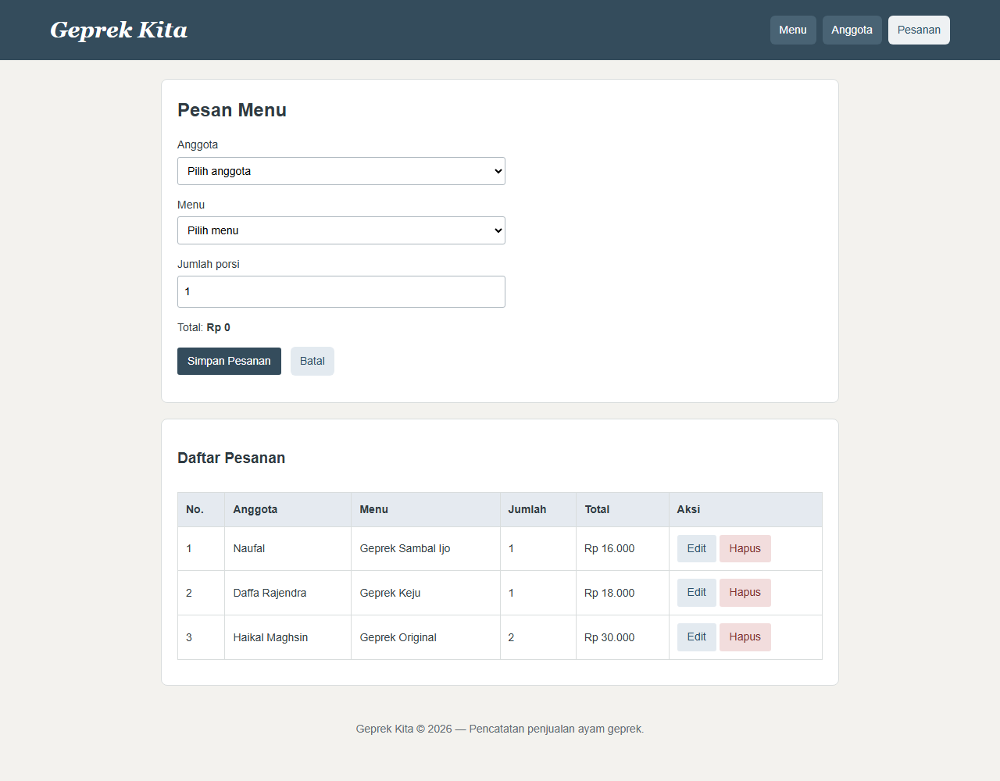

# Handbook Pembuatan Web Geprek Kita

**Haikal Maghsin · NIM 254107020189 · TI 2D**  
Desain dan Pemrograman Web · Panduan praktik untuk UTS  
Edisi revisi · 27 September 2026

Panduan ini mengikuti urutan membangun dan memahami aplikasi: persiapan, struktur halaman, desain, interaksi, database, dan proses transaksi. Buka proyek sambil membaca, jalankan setiap langkah, lalu cocokkan hasilnya.

Potongan kode merupakan bagian penting dari implementasi, bukan pengganti semua isi file. Gunakan berkas sumber yang disebutkan untuk melihat kode lengkap. Bila kode sudah ada, pelajari dan ubah salinan latihan; jangan menempel ulang potongan hingga menjadi duplikat.

## Cara menggunakan handbook

1. Baca tujuan dan langkah kerja setiap bab.
2. Buka file yang dirujuk.
3. Ikuti penjelasan kode dan perubahan kecil yang disarankan.
4. Periksa hasil melalui browser.
5. Catat pengujian aktual pada bab terakhir.

Screenshot diambil dari aplikasi lokal saat revisi. Screenshot membuktikan tampilan yang terlihat, bukan bukti seluruh operasi simpan, edit, dan hapus sudah diuji.

## Bab 1 — Mengenal aplikasi

**Tujuan:** memahami kebutuhan sebelum menulis kode.

### Langkah kerja

1. Tentukan pengguna aplikasi: petugas yang mencatat pelanggan dan pesanan.
2. Tentukan tiga halaman inti: Menu, Anggota, dan Pesanan.
3. Tentukan data: identitas pelanggan, pilihan menu, harga, dan jumlah.
4. Batasi fitur agar proyek tetap mudah dijelaskan.

### Hasil tampilan awal



Gambar 1. Halaman menu menampilkan tiga pilihan makanan dan tautan pemesanan.

Geprek Kita mencatat anggota pelanggan dan pesanan makanan. Aplikasi menggunakan HTML, CSS, JavaScript, PHP, dan PostgreSQL. Supabase menyediakan database PostgreSQL yang dihubungi PHP melalui PDO.

Repository terkait: [PRAKDPWeb26_2D_Haikal-Maghsin_Deploy](https://github.com/HaikalMaghsin/PRAKDPWeb26_2D_Haikal-Maghsin_Deploy).

Handbook disusun dari berkas lokal terbaru yang terhubung ke repository tersebut. Akses GitHub belum berhasil diverifikasi saat penyusunan, dan perubahan lokal belum tentu sudah di-push. Jadi penjelasan mengacu pada kode lokal, bukan klaim bahwa semua isinya sudah tersedia di GitHub.

Fitur yang ada:
- Menampilkan tiga menu dan harga.
- Menambah, melihat, mengedit, menghapus, dan mencari anggota.
- Menambah, melihat, mengedit, dan menghapus pesanan.
- Menghitung perkiraan total di browser.
- Memvalidasi input di browser dan di PHP.
- Menyimpan anggota dan pesanan ke database jika koneksi dan tabel sudah siap.

Satu pesanan memuat satu jenis menu. Proyek belum menyediakan login, pembayaran, keranjang banyak menu, atau pengelolaan stok. Menu disimpan sebagai array PHP, bukan tabel database.

**Status saat revisi:** halaman pesanan lokal menampilkan data tanpa pesan koneksi gagal. Ini menunjukkan pembacaan data berjalan pada sesi tersebut. Operasi tambah, edit, dan hapus belum diuji ulang saat revisi handbook.

## Bab 2 — Menyiapkan proyek dan server

**Tujuan:** dapat membuka proyek melalui PHP, bukan dengan klik langsung file PHP.

### Langkah kerja

1. Buka folder repo deploy di VS Code.
2. Periksa struktur file di bawah.
3. Siapkan PHP, ekstensi database, dan konfigurasi lokal.
4. Jalankan server dan buka /prak8/.
5. Pastikan daftar menu muncul sebelum melanjutkan.

Alamat yang dibuka pengguna tidak selalu sama dengan letak file. Rute `/prak8/` diarahkan ke kode di folder `api/`.

| Alamat / file | Kegunaan |
| --- | --- |
| `/` → `index.html` | Masterpage untuk membuka praktikum 1–8 |
| `/prak8/index.php` → `api/index.php` | Halaman menu Geprek Kita |
| `api/includes/header.php` | Bagian atas, navigasi, fungsi esc |
| `api/includes/footer.php` | Bagian bawah dan pemanggilan JavaScript |
| `api/includes/menu.php` | Array nama menu dan harga |
| `api/includes/env.php` | Membaca konfigurasi lokal dari .env |
| `api/includes/koneksi.php` | Membuat koneksi PDO ke PostgreSQL |
| `api/includes/session.php` | Memulai session untuk pesan sementara |
| `api/anggota/list.php` | Membaca dan menampilkan anggota |
| `api/anggota/tambah.php` | Form tambah anggota |
| `api/anggota/proses_tambah.php` | Validasi dan INSERT anggota |
| `api/anggota/edit.php` | Mengambil anggota berdasarkan ID untuk form edit |
| `api/anggota/proses_edit.php` | UPDATE atau DELETE anggota |
| `api/pesanan/list.php` | Form, daftar, tambah, edit, dan hapus pesanan |
| `assets/css/style.css` | CSS aplikasi Geprek Kita |
| `assets/js/app.js` | Validasi, konfirmasi, pencarian, dan total |
| `sql/02_geprek.sql` | Struktur tabel anggota dan pesanan |
| `router.php` | Pengaturan alamat ketika server PHP lokal dijalankan |
| `vercel.json` | Pengaturan rute dan fungsi PHP untuk deployment |

Masterpage memakai `assets/css/masterpage.css`, bukan CSS aplikasi. Repo praktikum berisi sumber latihan; repo deploy ini berisi masterpage dan salinan latihan yang siap ditampilkan.


Session dipakai untuk pesan sementara setelah redirect, misalnya “Anggota berhasil ditambahkan.” Data anggota dan pesanan tetap berada di PostgreSQL, bukan session. Session sementara di hosting serverless tidak dijamin tersedia pada instance lain; jangan menjadikannya penyimpanan utama.

### Menjalankan lokal

1. Pastikan PHP tersedia dan ekstensi pdo_pgsql aktif.
2. Siapkan .env dari .env.example; isi kredensial database sendiri.
3. Jalankan isi sql/02_geprek.sql di SQL Editor database yang dipakai.
4. Buka terminal di folder repo deploy.
5. Jalankan perintah berikut.

```powershell
php -S localhost:8000 router.php
```

Jika PHP belum masuk PATH pada komputer ini:

```powershell
& 'C:\xampp\php\php.exe' -S localhost:8000 router.php
```

Buka `http://localhost:8000/prak8/`. Alamat `http://localhost:8000/` adalah masterpage. Proyek ini tidak membutuhkan npm run dev.

### Arti konfigurasi

Contoh bentuk isi .env berikut hanya memakai placeholder. Ganti dengan nilai koneksi milik sendiri. Bila memakai database Supabase bernama postgres, jangan mengganti DB_NAME hanya karena judul aplikasi berubah.

```dotenv
DB_HOST=alamat_server_database
DB_PORT=5432
DB_NAME=postgres
DB_USER=username_database
DB_PASS="password_database_sendiri"
DB_SSLMODE=require
```

Di terminal, perintah `php -m` menampilkan ekstensi aktif. Cari `pdo_pgsql`. Jika tidak ada, aktifkan ekstensi itu pada php.ini milik PHP yang sedang dijalankan, lalu restart server PHP.

| Variabel | Isi |
| --- | --- |
| DB_HOST | Alamat server database |
| DB_PORT | Port koneksi |
| DB_NAME | Nama database, bukan connection string lengkap |
| DB_USER | Username database |
| DB_PASS | Password database, bukan password akun dashboard |
| DB_SSLMODE | Pengaturan SSL; ikuti konfigurasi koneksi yang digunakan |
| DATABASE_URL | Alternatif URI koneksi lengkap |

Kode memprioritaskan DATABASE_URL jika terisi. Jika tidak, kode membaca variabel DB_*. Loader .env tidak menimpa variabel yang sudah tersedia di environment proses/server.

.env tidak boleh dimasukkan ke handbook atau Git. Pada hosting, isi Environment Variables yang diperlukan. Mengubah file lokal tidak otomatis memperbarui konfigurasi deployment.

## Bab 3 — Membuat kerangka halaman dan menu

**File utama:** api/includes/header.php, api/includes/footer.php, api/includes/menu.php, api/index.php.

**Tujuan:** memahami bagaimana satu kerangka dipakai banyak halaman.

### Langkah kerja

1. Letakkan pembuka HTML, judul, CSS, header, dan navigasi di header.php.
2. Letakkan penutup halaman dan script di footer.php.
3. Tulis array menu di menu.php.
4. Muat header dan menu melalui index.php.
5. Gunakan foreach untuk menghasilkan baris tabel.

```php
$page_title = 'Menu';
include __DIR__ . '/includes/header.php';
require __DIR__ . '/includes/menu.php';
```

page_title memberi nama halaman. include memuat kerangka. require memuat menu yang dibutuhkan. __DIR__ membuat lokasi file dihitung dari folder file PHP, bukan dari alamat browser.

```php
foreach ($daftarMenu as $menu) {
    echo '<tr><td>' . esc($menu['nama']) . '</td></tr>';
}
```

Potongan di atas adalah contoh minimal untuk memahami perulangan. Implementasi lengkap di index.php juga menampilkan harga dengan number_format.

**Periksa hasil:** tiga baris menu muncul. Ubah satu nama pada menu.php, refresh, dan pastikan perubahan terlihat.

| Kode | Makna |
| --- | --- |
| $nama | Variabel PHP |
| $_POST['nama'] | Nilai nama dari form POST |
| $_GET['id'] | Nilai id dari URL |
| ?? | Nilai pengganti jika data tidak ada atau null |
| trim() | Menghapus spasi di awal dan akhir |
| if / else | Memilih tindakan berdasarkan kondisi |
| foreach | Mengulang setiap item array |
| require / include | Memuat file PHP lain |
| require_once | Memuat file wajib sekali saja |
| __DIR__ | Folder tempat file PHP itu berada |
| header('Location: ...') | Mengarahkan browser ke alamat lain |
| exit | Menghentikan eksekusi setelah redirect |
| try / catch | Menangani kegagalan melalui exception |

Contoh membaca form:

```php
$nama = trim($_POST['nama'] ?? '');
```

Jika nama belum dikirim, gunakan string kosong supaya tidak membaca indeks yang tidak tersedia.

Menu menggunakan array asosiatif:

```php
$daftarMenu = [
    'original' => ['nama' => 'Geprek Original', 'harga' => 15000],
    'keju' => ['nama' => 'Geprek Keju', 'harga' => 18000],
    'sambal_ijo' => ['nama' => 'Geprek Sambal Ijo', 'harga' => 16000],
];
```

Kode seperti `original` menjadi kunci menu. Angka harga tidak memakai titik ribuan. Titik pemisah ditambahkan saat ditampilkan.

Fungsi `esc()` di header memakai `htmlspecialchars(..., ENT_QUOTES, 'UTF-8')`. Tujuannya membuat isi pengguna ditampilkan sebagai teks HTML, bukan dianggap markup. Ini berbeda dari prepared statement yang melindungi pemakaian nilai dalam SQL.

## Bab 4 — Membuat form dan tabel HTML

**File utama:** api/anggota/tambah.php dan api/pesanan/list.php.

**Tujuan:** menghubungkan input yang terlihat dengan data yang dikirim.

### Langkah kerja

1. Buat form anggota berisi nama, nomor anggota, alamat, dan nomor HP.
2. Beri setiap input label, id, dan name yang sesuai.
3. Gunakan method POST serta action proses_tambah.php pada form anggota.
4. Buat form pesanan dengan select anggota, select menu, dan input jumlah.
5. Siapkan tabel untuk menampilkan hasil.



Gambar 2. Form anggota sebelum diisi. Nama input menjadi kunci data pada PHP.

**Periksa hasil:** klik label untuk memfokuskan input; gunakan Tab untuk berpindah kolom.

### Menghubungkan form dengan PHP

Berikut contoh minimal pola form anggota. Form lengkap di tambah.php juga mempunyai nomor anggota, alamat, dan nomor HP.

```html
<form method="post" action="proses_tambah.php"
      data-validate="true" novalidate>
    <label for="nama">Nama</label>
    <input type="text" id="nama" name="nama" required autofocus>
    <button type="submit">Simpan anggota</button>
</form>
```

1. Browser membuka tambah.php dan menampilkan form.
2. Ketika tombol Simpan ditekan, JavaScript memeriksa isian.
3. Jika lolos, action mengirim form ke proses_tambah.php dalam folder yang sama.
4. PHP membaca nilai melalui `$_POST['nama']`.

Pada form pesanan, action tidak ditulis. Browser mengirim form kembali ke halaman pesanan yang sedang dibuka. Karena itu, pengolahan POST ditempatkan di bagian atas pesanan/list.php, sebelum HTML dikirim.

Buka `api/pesanan/list.php` dan `api/includes/header.php`.

| Elemen / atribut | Penjelasan sederhana |
| --- | --- |
| header, nav, main, footer | Membagi halaman menurut fungsinya |
| section | Mengelompokkan bagian isi |
| table, thead, tbody, tr, th, td | Menyusun tabel dan baris data |
| form method="post" | Mengirim isian dalam badan permintaan HTTP |
| label for="jumlah" | Menghubungkan judul kolom dengan input ber-ID jumlah |
| name="jumlah" | Nama data yang dibaca PHP dari kiriman form |
| id="jumlah" | Penanda elemen untuk label, CSS, atau JavaScript |
| required | Menandai kolom wajib |
| autofocus | Meminta browser memfokuskan kolom saat halaman dibuka |
| min, max, step | Batas angka dan langkah nilai yang diizinkan |
| input type="hidden" | Mengirim ID/aksi tanpa menampilkan kotak input |
| data-harga | Menyimpan harga pada option untuk dibaca JavaScript |

Contoh input dari aplikasi:

```html
<input type="number" id="jumlah" name="jumlah"
       min="1" max="100" step="1" required>
```

Artinya: jumlah wajib diisi bilangan bulat antara 1 dan 100. Pada aplikasi, atribut `value` juga diisi dari PHP supaya isian edit tampil kembali.

Form menggunakan `novalidate` agar pesan validasi otomatis saat submit digantikan oleh pesan JavaScript buatan sendiri. JavaScript tetap memanggil `checkValidity()` untuk membaca aturan input.

**Penting:** hidden input bukan tempat menyembunyikan rahasia. Nilainya tetap bisa dilihat dan diubah melalui browser. POST juga tidak otomatis membuat data aman; HTTPS mengenkripsi pengiriman.

## Bab 5 — Menata halaman dengan CSS

**File utama:** assets/css/style.css.

**Tujuan:** memahami setiap aturan visual yang digunakan.

### Langkah kerja

1. Atur font, warna teks, dan background pada body.
2. Gunakan flex pada header agar nama warung dan navigasi berjajar.
3. Beri main batas lebar dan panel ruang dalam.
4. Atur input, tombol, link, dan tabel.
5. Tambahkan hover dan penanda fokus.
6. Tambahkan media query agar header ditumpuk di HP.

**Latihan:** ubah padding tombol dari 7px 12px menjadi 9px 16px. Amati perubahan tinggi dan lebar. Kembalikan jika terlalu besar.

**Periksa hasil:** pada layar sempit, navigasi tetap terbaca dan tabel bisa digeser.

Buka `assets/css/style.css`. Pola CSS adalah selector, properti, dan nilai.

```css
nav a {
    color: white;
    background: #496374;
}
```

`nav a` memilih link di dalam navigasi. `color` mengatur warna tulisan. `background` mengatur latar link.

| Bagian CSS | Kegunaan dalam proyek |
| --- | --- |
| box-sizing: border-box | Padding dan border ikut diperhitungkan dalam width |
| font-family | Jenis huruf; Georgia untuk nama warung |
| font-size | Besar tulisan |
| line-height | Tinggi baris tulisan |
| padding | Jarak isi dengan tepi dalam kotak |
| margin | Jarak di luar kotak |
| border | Garis pinggir |
| border-radius | Sudut membulat |
| max-width: 900px | Membatasi lebar konten |
| margin: 24px auto | Jarak atas-bawah 24px, posisi horizontal di tengah |
| display: flex | Mengatur anak elemen dalam susunan fleksibel |
| gap | Jarak antar-item flex atau grid |
| overflow-x: auto | Membolehkan tabel digeser horizontal |
| :hover | Tampilan ketika pointer berada di elemen |
| :focus-visible | Penanda fokus, misalnya saat memakai keyboard |
| @media | Aturan yang berlaku pada ukuran layar tertentu |

### Mengubah ukuran tombol

Cari selector `button, .btn-tambah, .btn-aksi`.

```css
padding: 7px 12px;
font: inherit;
line-height: 1.4;
```

7px adalah jarak atas-bawah, 12px jarak kiri-kanan. Ubah menjadi `9px 16px` untuk tombol lebih besar. `font: inherit` mengikuti font induknya. Jika ingin menentukan ukuran khusus, tambahkan `font-size: 15px` setelah `font: inherit`.

Kalau hanya tombol Edit dan Hapus yang ingin diubah, buat aturan khusus `.btn-aksi`. Jangan mengubah semua tombol jika kebutuhan hanya pada tabel.

### Mengubah warna dan bentuk link

Ubah `background` pada selector `a` untuk link umum, atau `nav a` untuk navigasi. Selector navigasi lebih spesifik. Aturan `nav a[aria-current="page"]` memberi warna berbeda pada halaman aktif.

### Tampilan HP

```css
@media (max-width: 600px) {
    header { flex-direction: column; align-items: flex-start; }
    .panel { padding: 14px; }
}
```

Saat lebar layar maksimal 600px, isi header ditumpuk dan ruang dalam panel dikurangi. Tabel memakai pembungkus dengan `overflow-x: auto` supaya tetap bisa dibaca di layar kecil.

## Bab 6 — Menambahkan interaksi JavaScript

**File utama:** assets/js/app.js.

**Tujuan:** membuat form mudah digunakan sebelum data dikirim ke server.

### Langkah kerja

1. Hubungkan app.js melalui footer agar elemen HTML sudah tersedia.
2. Pasang event submit untuk konfirmasi hapus.
3. Periksa kolom wajib dan batasi input angka.
4. Tampilkan pesan serta arahkan fokus ke kolom salah pertama.
5. Hubungkan perubahan menu dan jumlah ke fungsi hitungTotal.
6. Tambahkan pencarian anggota.

**Periksa hasil:** form kosong menampilkan pesan, memilih menu mengubah total, dan Batal pada konfirmasi tidak mengirim penghapusan.

Buka `assets/js/app.js`.

### A. Konfirmasi hapus

`querySelectorAll(".form-hapus")` mengambil semua form hapus. `addEventListener("submit", ...)` menunggu form dikirim. `confirm()` menampilkan pertanyaan. Jika pengguna memilih Batal, `event.preventDefault()` menghentikan submit.

Konfirmasi ini membantu menghindari salah klik; penghapusan sebenarnya dilakukan PHP dan SQL.

### B. Validasi dan fokus kursor

Urutan kode:
1. Ambil form dengan atribut `data-validate`.
2. Saat submit, periksa input dan select.
3. Gunakan `trim()` agar isian spasi saja dianggap kosong.
4. Buat elemen span berisi pesan “Form ini wajib diisi.”
5. Tandai input dengan `aria-invalid` dan hubungkan pesan melalui `aria-describedby`.
6. Batalkan submit jika salah, lalu panggil `focus()` pada input salah pertama.

Saat pengguna mengetik lagi, pesan sebelumnya dihapus. Validasi JavaScript membantu pengguna, tetapi bisa dilewati; PHP tetap harus memeriksa input.



Gambar 3. Setelah form kosong dikirim, empat pesan wajib diisi muncul dan fokus kembali ke kolom Nama. Screenshot berasal dari uji browser lokal tanpa menambah data database.

### C. Menghitung total

Potongan asli dari fungsi `hitungTotal()`:

```javascript
const harga = Number(menu.selectedOptions[0].dataset.harga || 0);
const total = harga * Number(jumlah.value);
document.getElementById("total").textContent =
    "Rp " + total.toLocaleString("id-ID");
```

`selectedOptions[0]` adalah pilihan menu aktif. `dataset.harga` membaca `data-harga`. `Number()` mengubah nilai menjadi angka. `textContent` menampilkan teks. Format `id-ID` memberi pemisah angka sesuai Indonesia.

Event `change` dipakai saat menu berganti; event `input` dipakai saat jumlah berubah.

### D. Pencarian anggota

Kode membaca teks setiap baris tabel, mengubahnya menjadi huruf kecil, lalu memeriksa `includes()`. Baris yang tidak cocok diberi `hidden = true`.

Pencarian ini menyaring data yang sudah tampil di browser. Ia tidak mengirim query pencarian baru ke database.

## Bab 7 — Menyiapkan database dan koneksi PHP

**File utama:** sql/02_geprek.sql, api/includes/env.php, api/includes/koneksi.php.

**Tujuan:** menghubungkan data anggota dengan pesanannya.

### Langkah kerja

1. Buka SQL Editor pada database yang akan dipakai.
2. Jalankan isi lengkap sql/02_geprek.sql.
3. Pastikan tabel anggota dan pesanan terbentuk.
4. Isi konfigurasi .env dengan kredensial sendiri.
5. Periksa bahwa pdo_pgsql tersedia.
6. Buka halaman Anggota atau Pesanan untuk mencoba pembacaan data.

```php
$pdo = new PDO($dsn, $user, $pass, [
    PDO::ATTR_ERRMODE => PDO::ERRMODE_EXCEPTION
]);
```

dsn berisi jenis database, host, port, nama database, dan mode SSL. user dan pass berisi kredensial dari environment. Mode exception membuat kegagalan dapat ditangani oleh try/catch.

Kode koneksi memilih DATABASE_URL jika tersedia; jika tidak, variabel DB_* dipakai. Jangan menulis password langsung dalam handbook atau file kode yang diunggah.

**Periksa hasil:** halaman membaca data atau menampilkan kondisi kosong tanpa pesan gagal koneksi. Berhasil menampilkan halaman Menu saja belum membuktikan database tersambung karena halaman itu membaca array PHP.

Struktur resmi proyek ada di `sql/02_geprek.sql`.

### Membuat kedua tabel

Jalankan perintah ini melalui SQL Editor pada database yang digunakan aplikasi. Isinya mengikuti skema proyek:

```sql
CREATE TABLE IF NOT EXISTS anggota (
    id SERIAL PRIMARY KEY,
    nama VARCHAR(255) NOT NULL,
    no_anggota VARCHAR(50) NOT NULL UNIQUE,
    alamat VARCHAR(255),
    no_hp VARCHAR(30)
);

CREATE TABLE IF NOT EXISTS pesanan (
    id SERIAL PRIMARY KEY,
    anggota_id INTEGER NOT NULL REFERENCES anggota(id) ON DELETE RESTRICT,
    menu VARCHAR(50) NOT NULL,
    harga INTEGER NOT NULL CHECK (harga > 0),
    jumlah INTEGER NOT NULL CHECK (jumlah BETWEEN 1 AND 100),
    dibuat_pada TIMESTAMP NOT NULL DEFAULT CURRENT_TIMESTAMP
);
```

Buat anggota terlebih dahulu karena pesanan merujuk ID anggota. SERIAL menyediakan nomor otomatis, NOT NULL mewajibkan nilai, UNIQUE mencegah nomor anggota kembar, dan CHECK membatasi nilai. IF NOT EXISTS menghindari pembuatan ulang tabel yang sudah ada; perintah ini tidak memperbarui struktur tabel lama secara otomatis.

```text
anggota                           pesanan
id (primary key)  1 ──────── N    anggota_id (foreign key)
nama                              id (primary key)
no_anggota (unique)                menu
alamat                            harga
no_hp                             jumlah
                                  dibuat_pada
```

Satu anggota bisa memiliki banyak pesanan. Setiap pesanan menunjuk satu anggota.

| Kolom | Tipe / aturan |
| --- | --- |
| anggota.id | SERIAL, primary key |
| anggota.nama | VARCHAR(255), wajib di database |
| anggota.no_anggota | VARCHAR(50), wajib dan unik |
| anggota.alamat | VARCHAR(255), database mengizinkan null |
| anggota.no_hp | VARCHAR(30), database mengizinkan null |
| pesanan.id | SERIAL, primary key |
| pesanan.anggota_id | INTEGER, wajib, foreign key ke anggota |
| pesanan.menu | VARCHAR(50), kode menu |
| pesanan.harga | INTEGER, harus lebih dari 0 |
| pesanan.jumlah | INTEGER, antara 1 dan 100 |
| pesanan.dibuat_pada | TIMESTAMP, otomatis memakai waktu saat insert |

Form dan PHP mewajibkan alamat serta nomor HP, meskipun tabel database tidak menggunakan NOT NULL pada kedua kolom itu. Jadi aturan aplikasi lebih ketat daripada skema pada bagian ini.

`ON DELETE RESTRICT` mencegah anggota dihapus saat masih dirujuk oleh pesanan. Hapus pesanan terkait terlebih dahulu jika memang ingin menghapus anggota latihan.

Total tidak menjadi kolom tersendiri: dihitung dari `harga × jumlah`. Harga disimpan pada pesanan. Mengubah array harga tidak langsung mengubah pesanan lama, tetapi menyimpan edit pesanan akan mengambil harga menu yang berlaku saat edit.

## Bab 8 — Memproses tambah, edit, dan hapus

**File utama:** api/anggota/proses_tambah.php, api/anggota/proses_edit.php, api/pesanan/list.php.

**Tujuan:** mengikuti satu transaksi dari form sampai ke database.

### Langkah kerja: anggota

1. Ambil POST dan rapikan spasi dengan trim.
2. Periksa semua kolom wajib.
3. Siapkan INSERT menggunakan placeholder.
4. Jalankan execute dan tangani nomor anggota yang duplikat.
5. Simpan pesan sementara, redirect, lalu tampilkan daftar.
6. Untuk edit, gunakan ID agar UPDATE hanya mengubah anggota yang dipilih.
7. Untuk hapus, kirim aksi=hapus melalui POST.

### Langkah kerja: pesanan

1. Baca anggota_id, menu, dan jumlah dari POST.
2. Validasi ID, kode menu, dan jumlah bulat 1–100.
3. Ambil harga dari array PHP, bukan total kiriman browser.
4. Gunakan INSERT jika ID kosong atau UPDATE jika mengedit.
5. Gunakan DELETE ketika aksi adalah hapus.
6. Jalankan SELECT dengan JOIN untuk menampilkan nama anggota.



Gambar 4. Tampilan pesanan aktual saat revisi. Data yang sudah ada hanya dibaca; tidak diubah untuk membuat ilustrasi.

**Periksa hasil:** setelah koneksi siap, gunakan data khusus latihan untuk memeriksa tambah, edit, dan hapus.

CRUD adalah Create, Read, Update, Delete.

### Menelusuri validasi sebelum INSERT

Potongan dari pesanan/list.php:

```php
$anggotaId = filter_input(INPUT_POST, 'anggota_id', FILTER_VALIDATE_INT);
$kode = $_POST['menu'] ?? '';
$jumlah = filter_input(INPUT_POST, 'jumlah', FILTER_VALIDATE_INT);
if (!$anggotaId || !isset($daftarMenu[$kode]) ||
    !$jumlah || $jumlah < 1 || $jumlah > 100) {
    throw new RuntimeException('Pilih anggota, menu, dan jumlah antara 1 sampai 100.');
}
$menu = $daftarMenu[$kode];
```

filter_input memeriksa apakah nilai berupa bilangan bulat. isset memastikan kode menu dikenali. Jika salah, exception menghentikan jalur simpan dan ditangkap oleh catch. ID anggota juga harus benar-benar ada; hubungan foreign key diperiksa database ketika query dijalankan.

### Mengisi form edit dan memperbarui data

Pada anggota/edit.php, ID dari URL dipakai untuk mengambil data:

```php
$stmt = $pdo->prepare('SELECT * FROM anggota WHERE id = :id');
$stmt->execute(['id' => $id]);
$anggota = $stmt->fetch(PDO::FETCH_ASSOC);
```

fetch mengambil satu baris sebagai array dengan nama kolom sebagai kunci. Form mengisi value menggunakan data itu, misalnya `esc($anggota['nama'])`. ID dimasukkan ke hidden input untuk dikirim kembali saat menyimpan.

Untuk pesanan, query pembaruannya adalah:

```php
$stmt = $pdo->prepare(
    'UPDATE pesanan SET anggota_id = ?, menu = ?, harga = ?, jumlah = ? WHERE id = ?'
);
$stmt->execute([$anggotaId, $kode, $menu['harga'], $jumlah, $id]);
```

SET berisi kolom yang diganti. WHERE menentukan pesanan yang diubah. Urutan lima nilai pada execute harus sama dengan urutan lima placeholder dalam query.

| Operasi | SQL | Contoh |
| --- | --- | --- |
| Create | INSERT | Menambah anggota atau pesanan |
| Read | SELECT | Mengisi tabel dan pilihan anggota |
| Update | UPDATE | Mengubah pesanan terpilih |
| Delete | DELETE | Menghapus berdasarkan ID |

Contoh asli penambahan pesanan:

```php
$stmt = $pdo->prepare(
    'INSERT INTO pesanan (anggota_id, menu, harga, jumlah) VALUES (?, ?, ?, ?)'
);
$stmt->execute([$anggotaId, $kode, $menu['harga'], $jumlah]);
```

`prepare()` menyiapkan SQL dengan placeholder. `execute()` memasukkan nilai sesuai urutan. Nilai input dipisahkan dari struktur SQL sehingga tidak digabung langsung menjadi perintah SQL.

Contoh penghapusan:

```php
$stmt = $pdo->prepare('DELETE FROM pesanan WHERE id = ?');
$stmt->execute([$id]);
```

`WHERE id = ?` menentukan baris yang dihapus. Tanpa WHERE, DELETE dapat menghapus seluruh isi tabel. Jangan mencoba query tanpa kondisi pada data yang masih dibutuhkan.

Query daftar pesanan:

```sql
SELECT p.*, a.nama
FROM pesanan p
JOIN anggota a ON a.id = p.anggota_id
ORDER BY p.id DESC
```

`p` dan `a` adalah alias tabel. JOIN mengambil nama anggota agar daftar pesanan tidak hanya menampilkan nomor ID. DESC menampilkan ID terbesar terlebih dahulu.

### Jalur tambah, edit, dan hapus pesanan

- Tambah: POST dengan ID kosong → validasi → INSERT.
- Buka edit: GET `?id=...` → isi form dari pesanan yang cocok.
- Simpan edit: POST dengan ID → validasi → UPDATE.
- Hapus: POST dengan `aksi=hapus` dan ID → DELETE.
- Berhasil: simpan pesan session → redirect ke list.php.

Redirect setelah POST mengurangi risiko form terkirim ulang ketika halaman hasil di-refresh.


### Alur menyeluruh


```text
Browser membuka halaman
        ↓
PHP membaca menu / database
        ↓
HTML dikirim ke browser
        ↓
Pengguna mengisi form
        ↓
JavaScript memeriksa input dan menampilkan total
        ↓
Form dikirim melalui POST
        ↓
PHP memeriksa input lagi
        ↓
PDO menjalankan SQL ke PostgreSQL
        ↓
Redirect → halaman daftar menampilkan data terbaru
```

JavaScript berjalan di browser. PHP berjalan di server. PostgreSQL menyimpan data. Ketiganya punya tugas berbeda.

Contoh: pengguna memilih Geprek Original sebanyak 2 porsi. Browser menampilkan Rp 30.000. PHP mengambil harga Original dari array menu, lalu menyimpan harga 15.000 dan jumlah 2. Total pada daftar dihitung dari harga tersimpan dikali jumlah.

## Bab 9 — Pengujian dan perbaikan

**Tujuan:** mencatat bukti hasil, bukan hanya menyiapkan daftar skenario.

### Hasil pemeriksaan saat revisi

| Pemeriksaan | Hasil aktual |
| --- | --- |
| Halaman Menu lokal | Terbuka dan menampilkan daftar menu |
| Halaman Tambah Anggota lokal | Form terlihat |
| Halaman Pesanan lokal | Daftar pesanan terlihat tanpa pesan gagal koneksi |
| Submit form anggota kosong | Empat pesan validasi muncul; fokus kembali ke Nama |
| Perkiraan harga Original × 2 | JavaScript menampilkan Rp 30.000 |
| Jumlah 0, 101, dan 1.5 | checkValidity di browser mengembalikan false |
| Tambah, edit, dan hapus database | Belum diuji ulang pada revisi dokumentasi |

### Langkah kerja

1. Jalankan skenario dengan data latihan.
2. Catat hasil aktual, tanggal, dan jika perlu screenshot.
3. Bandingkan dengan hasil yang diharapkan.
4. Jika gagal, periksa lapisan yang terkait: browser, PHP, atau database.
5. Perbaiki penyebab lalu ulangi skenario yang gagal.

Gunakan data khusus latihan, bukan data penting. Isi hasil aktual setelah mencoba; daftar ini adalah skenario uji, bukan catatan uji yang sudah lulus.

1. Buka masterpage dan Launch Praktikum 8.
2. Jelaskan daftar menu, anggota, dan pesanan.
3. Tambah anggota “Pelanggan Uji UTS” dengan nomor unik, alamat, dan nomor HP contoh.
4. Cari anggota tersebut melalui kotak pencarian.
5. Edit nama, simpan, lalu periksa tabel.
6. Pesan Geprek Original sebanyak 2 porsi; total yang diharapkan Rp 30.000.
7. Simpan, refresh halaman, lalu periksa apakah pesanan tetap tampil dari database.
8. Edit jumlah menjadi 3; total yang diharapkan Rp 45.000.
9. Coba hapus anggota yang masih punya pesanan; operasi seharusnya ditolak.
10. Klik Hapus pesanan, pilih Batal; baris harus tetap ada.
11. Hapus pesanan dengan konfirmasi, lalu hapus anggota latihan.
12. Tunjukkan validasi form kosong dan batas jumlah 1–100.

| Pengujian | Hasil yang diharapkan | Hasil aktual |
| --- | --- | --- |
| Form wajib kosong | Pesan muncul, fokus pindah ke kolom salah | Lulus di form anggota pada 27 September 2026 |
| Jumlah 0 / 101 / pecahan | Ditolak validasi | Lulus pemeriksaan browser; penolakan POST langsung belum diuji |
| Nomor anggota duplikat | Pesan nomor sudah digunakan | Belum diisi |
| Refresh setelah simpan | Tidak menggandakan data dari POST sebelumnya | Belum diisi |
| Ubah menu/jumlah | Perkiraan total ikut berubah | Original × 2 menampilkan Rp 30.000 pada 27 September 2026 |
| Hapus anggota yang dirujuk pesanan | Ditolak database | Belum diisi |

Jangan mengaku pengujian berhasil sebelum melihat hasilnya. Saat revisi, pembacaan data terlihat berhasil. Operasi tulis tetap perlu dibuktikan dengan pengujian terpisah.


### Menangani masalah


| Gejala | Yang diperiksa |
| --- | --- |
| Data warung belum bisa dimuat | Koneksi gagal; periksa konfigurasi dan penyebab melalui pemeriksaan lokal yang tidak membocorkan kredensial |
| password authentication failed | Password database tidak cocok dengan pengguna/server yang dituju |
| Tabel pesanan belum tersedia | Jalankan skema di database yang benar |
| could not find driver | Aktifkan pdo_pgsql pada PHP yang sedang dijalankan |
| Nomor anggota sudah digunakan | Gunakan nomor berbeda; kolom no_anggota bersifat unik |
| Anggota gagal dihapus | Periksa apakah masih memiliki pesanan |
| Tombol simpan pesanan nonaktif | Pastikan koneksi tersedia dan anggota sudah ada |
| CSS belum berubah | Periksa file CSS yang tepat lalu lakukan hard refresh |
| PHP terbaca sebagai teks | Jalankan melalui server PHP, bukan membuka file langsung |

Pesan umum “data belum tersedia” bukan bukti pasti bahwa tabel hilang; query bisa gagal karena sebab lain. Periksa penyebab sebelum mengubah skema.

## Lampiran A — Tanya jawab UTS

Gunakan setelah memahami langkah pembuatan. Coba jawab tanpa membaca terlebih dahulu.

**Apa fungsi aplikasi ini?**  
Mencatat anggota pelanggan dan pesanan ayam geprek. Data transaksi disimpan melalui PHP ke PostgreSQL.

**Apa beda HTML, CSS, JavaScript, dan PHP?**  
HTML menyusun isi, CSS mengatur tampilan, JavaScript menangani interaksi di browser, PHP memproses permintaan di server.

**Mengapa ada validasi JavaScript dan PHP?**  
JavaScript memberi tanggapan cepat. PHP tetap memvalidasi karena permintaan bisa dikirim tanpa JavaScript.

**Apa beda id dan name pada input?**  
id menandai elemen halaman. name menjadi nama nilai yang dikirim oleh form.

**Apa beda GET dan POST di proyek ini?**  
GET dipakai untuk memilih data edit melalui URL. POST dipakai untuk mengirim perubahan data.

**Bagaimana tombol Edit tahu baris yang dipilih?**  
Link membawa ID. PHP mengambil atau memilih data yang cocok, lalu mengisi form. ID ikut dikirim saat menyimpan.

**Mengapa harga tidak dipercaya dari browser?**  
Nilai browser bisa diubah. PHP mengambil harga dari array menu dan menyimpan harga itu.

**Apa primary key dan foreign key?**  
Primary key mengidentifikasi baris secara unik. Foreign key menghubungkan baris ke data pada tabel lain.

**Mengapa memakai prepared statement?**  
Untuk memasukkan nilai melalui placeholder, sehingga input tidak digabung langsung sebagai struktur SQL.

**Apakah menu berada di database?**  
Belum. Menu berada di array pada includes/menu.php. Tabel database menyimpan anggota dan pesanan.

**Apa beda padding dan margin?**  
Padding adalah jarak di dalam kotak; margin jarak di luar kotak.

**Bagaimana membuat tampilan cocok untuk HP?**  
Memakai meta viewport, media query, dan pembungkus tabel yang dapat digeser.

**Apa fungsi session?**  
Di Geprek Kita, session membawa pesan sementara antarpemintaan. Database menyimpan data utama.

**Apakah aplikasi sudah siap menjadi toko online penuh?**  
Belum. Ini latihan pencatatan, belum ada login, otorisasi, proteksi CSRF, dan pembayaran. Prepared statement saja tidak mencakup semua kebutuhan keamanan aplikasi.

## Lampiran B — Latihan dan presentasi

Gunakan salinan latihan jika akan mengubah kode saat belajar.

1. Ubah tulisan “Geprek Kita” di header dan jelaskan dampaknya pada semua halaman yang include header.
2. Besarkan tombol melalui padding di style.css.
3. Ganti background nav a, lalu jelaskan bedanya dengan warna tulisan.
4. Ubah harga Original di menu.php, buka ulang halaman, lalu buat pesanan latihan baru.
5. Tambah satu item array menu dengan kode unik; periksa daftar menu dan pilihan pesanan.
6. Ubah batas jumlah menjadi 50. Sebutkan semua lapisan yang harus diselaraskan: atribut HTML, validasi PHP, dan constraint database. Mengedit file SQL saja tidak otomatis mengubah tabel yang sudah ada.
7. Jelaskan query JOIN tanpa membaca handbook.

Jika menambah menu, nama dan kode harus konsisten. Hindari mengganti atau menghapus kode menu yang sudah dipakai data pesanan tanpa merencanakan penanganan data lama.


### Presentasi singkat


“Saya membuat Geprek Kita untuk mencatat pelanggan dan pesanan ayam geprek. HTML digunakan untuk form dan tabel, CSS untuk tampilan, serta JavaScript untuk validasi, pencarian, konfirmasi hapus, dan perkiraan total. PHP menerima form, memeriksa input, lalu menjalankan query melalui PDO. Database memiliki tabel anggota dan pesanan yang terhubung lewat anggota_id. Harga diambil dari array PHP supaya perhitungan tidak hanya mengandalkan browser. Saya menempatkan aplikasi ini sebagai Praktikum 8 dan membukanya dari masterpage.”

Setelah itu, tunjukkan satu alur lengkap: tambah anggota → pesan dua porsi → simpan → edit → hapus. Utamakan bisa menjelaskan alasan setiap langkah.


### Urutan membaca berkas


1. api/index.php dan includes/menu.php: mulai dari halaman paling sederhana.
2. includes/header.php dan footer.php: pahami bagian halaman yang dipakai ulang.
3. assets/css/style.css: ubah satu properti sambil melihat hasil.
4. assets/js/app.js: pelajari empat interaksi satu per satu.
5. anggota/tambah.php dan proses_tambah.php: ikuti alur form ke SQL.
6. includes/env.php dan koneksi.php: pahami konfigurasi tanpa menampilkan rahasia.
7. sql/02_geprek.sql: jelaskan hubungan kedua tabel.
8. pesanan/list.php: ikuti percabangan tambah, edit, hapus, dan penampilan data.

Handbook ini khusus Geprek Kita. Desain masterpage dan materi lengkap Praktikum 1–7 tidak dibahas sebagai fitur aplikasi Geprek Kita.
